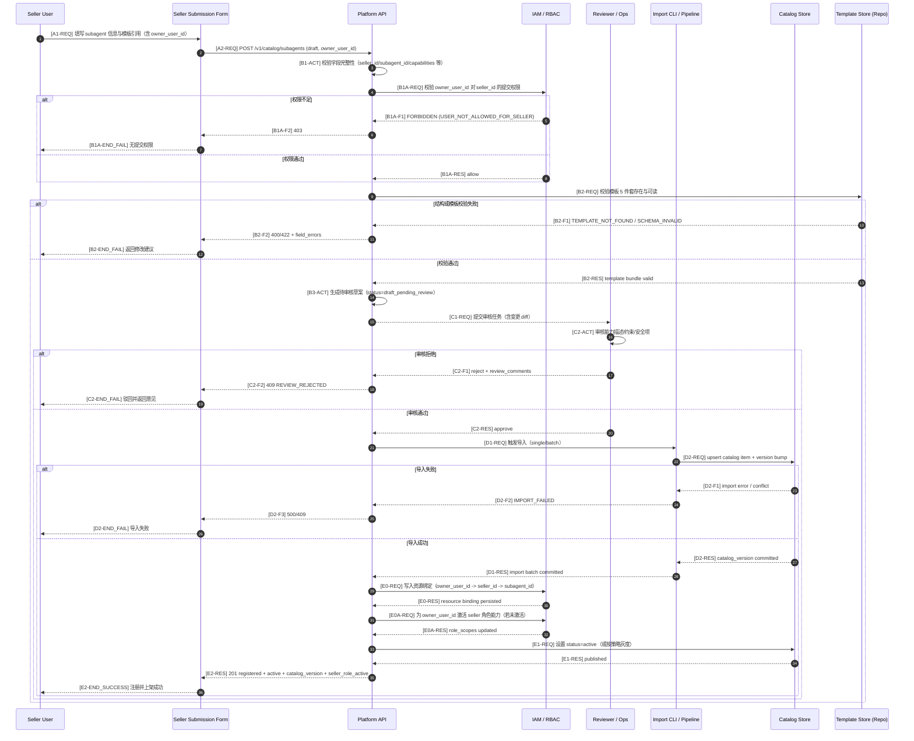

# Agent Registration Call Flow (Subagent Onboarding / Import)

## 关键澄清

- v0.1 下 seller 不直接维护线上 subagent 列表；由平台导入并建立 `seller_id -> subagent_id` 关联。
- seller agent 注册必须带 `owner_user_id`（提交人标识），用于审核与审计追踪。
- 只有当 agent 审核通过并导入成功后，`owner_user_id` 才可激活 `seller` 角色能力。
- `template_ref` 是模板语义绑定键；buyer 消费模板时走平台 API 下发。
- 注册与上架分离：`资料提交` 不等于 `active` 上架。
- 权限来源：seller 权限来自该用户自己的 API Key；不是单独再签发“seller 专用 key”。

## 阶段代号与编号规则（v1.1）

- `A`：提交 subagent 资料
- `B`：结构与合规校验
- `C`：人工审核
- `D`：导入目录与版本落库
- `E`：激活发布与回执

编号后缀：

- `-REQ`：请求消息
- `-RES`：响应消息
- `-ACT`：本地动作
- `-S*`：成功分支事件
- `-F*`：失败分支事件
- `-END_SUCCESS | -END_FAIL`：终态

## 最小状态机（建议）

- subagent 状态：`DRAFT_PENDING_REVIEW -> APPROVED -> IMPORTED -> ACTIVE`
- 驳回路径：`DRAFT_PENDING_REVIEW -> REJECTED -> RESUBMIT`

## 失败分支最小处置

- `TEMPLATE_NOT_FOUND/SCHEMA_INVALID`：卖家修模板后重提。
- `REVIEW_REJECTED`：按 review_comments 迭代资料。
- `IMPORT_FAILED`：回滚批次并重跑导入，保持目录版本单调。
- `USER_NOT_ALLOWED_FOR_SELLER`：先完成组织授权或管理员绑定后再提交。
