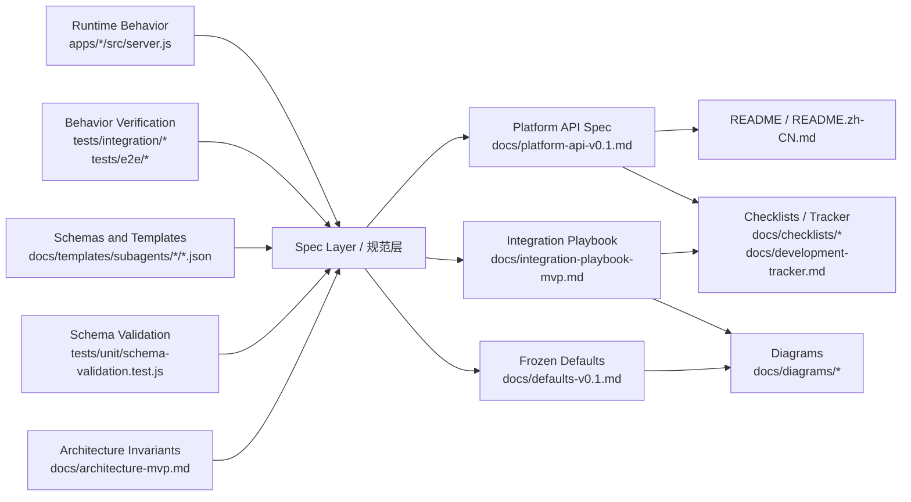

# Documentation Truth Source Map（v0.1）

本文档说明仓库内“真相源”和“衍生物”的分层关系，避免多个文档重复定义同一事实。

## 分层规则

- 真相源负责定义“系统实际上是什么”
- 规范层负责把真相源整理成稳定可读的规范
- 说明层负责面向不同读者传播，不得自行发明事实

## 结构图

## 判定规则

- 接口实际返回什么：以 `apps/*/src/server.js` 和 integration/e2e tests 为准
- 模板输入输出长什么样：以 `docs/templates/subagents/*/*.json` 和 schema 校验测试为准
- 系统不变量、模式边界、信任模型：以 `docs/architecture-mvp.md` 为准
- `docs/platform-api-v0.1.md`、`docs/integration-playbook-mvp.md`、`docs/defaults-v0.1.md` 必须贴合上述真相源
- `README`、图、checklist、tracker 只能转述，不应扩展协议事实
