# User Registration Call Flow (Default Buyer Identity + API Key)

## 关键澄清

- 主体模型：注册后默认获得 `buyer` 身份。
- `seller` 不是独立初始身份；只有当该用户提交的 seller agent 审核通过后才激活 `seller` 能力。
- 接入模式：`identity_onboarding_mode=register_buyer_default_then_activate_seller_on_agent_approval`。
- 鉴权方式：`api_auth_mode=api_key`。
- API Key 仅在签发时明文返回一次；平台仅保存摘要。
- API Key 与 `user_id` 绑定，按 `role_scopes` 控制可调用接口。
- 初始权限：注册成功后仅下发 `buyer` scope，不包含 `seller` scope。

## 阶段代号与编号规则（v1.1）

- `A`：注册申请提交
- `B`：字段校验与风险校验
- `C`：用户主体落库（默认 buyer）
- `D`：API Key 签发与绑定
- `E`：激活确认与回执

编号后缀：

- `-REQ`：请求消息
- `-RES`：响应消息
- `-ACT`：本地动作
- `-S*`：成功分支事件
- `-F*`：失败分支事件
- `-END_SUCCESS | -END_FAIL`：终态

```mermaid
sequenceDiagram
    autonumber
    participant U as Org User
    participant APP as Console / Form UI
    participant P as Platform API
    participant R as Risk / Policy Engine
    participant DB as Identity Store
    participant KMS as Key Service

    U->>APP: [A1-REQ] 填写用户主体信息（组织/联系方式）
    APP->>P: [A2-REQ] POST /v1/users/register (profile)

    P->>P: [B1-ACT] 基础字段校验（必填/格式/唯一性）
    P->>P: [B2-ACT] 规范化默认角色集（role_scopes={buyer})

    alt 字段校验失败
        P-->>APP: [B1-F1] 400 VALIDATION_FAILED (field_errors)
        APP-->>U: [B1-END_FAIL] 返回修正提示
    else 字段校验通过
        P->>R: [B3-REQ] 风险校验（重复主体/黑名单/频控）
        alt 风险不通过
            R-->>P: [B3-F1] reject (RISK_POLICY_BLOCKED)
            P-->>APP: [B3-F2] 403/429
            APP-->>U: [B3-END_FAIL] 拒绝注册或稍后重试
        else 风险通过
            R-->>P: [B3-RES] allow

            P->>DB: [C1-REQ] 创建用户记录（user_id, role_scopes={buyer}）
            alt 写入失败
                DB-->>P: [C1-F1] 存储异常/唯一键冲突
                P-->>APP: [C1-F2] 500/409
                APP-->>U: [C1-END_FAIL] 注册失败
            else 写入成功
                DB-->>P: [C1-RES] user_id created

                P->>KMS: [D1-REQ] 签发 API Key（绑定 user_id + role_scopes）
                alt 签发失败
                    KMS-->>P: [D1-F1] KEY_ISSUE_FAILED
                    P-->>APP: [D1-F2] 500
                    APP-->>U: [D1-END_FAIL] 注册失败
                else 签发成功
                    KMS-->>P: [D1-RES] api_key_plaintext + key_fingerprint
                    P->>DB: [D2-REQ] 保存 key 摘要与元数据
                    DB-->>P: [D2-RES] key binding persisted
                    P->>DB: [D3-ACT] 初始化权限策略（role_scopes={buyer}）

                    P-->>APP: [E1-RES] 201 user + roles={buyer} + api_key(once)
                    APP-->>U: [E1-END_SUCCESS] 展示注册成功与一次性密钥
                end
            end
        end
    end
```

## 最小状态机（建议）

- 用户状态：`PENDING -> ACTIVE | REJECTED`
- 角色状态：`BUYER_ACTIVE`（默认）; `SELLER_ACTIVE`（由 seller agent 审核通过后激活）
- Key 状态：`ISSUED -> ACTIVE -> ROTATING -> REVOKED`

## 失败分支最小处置

- `VALIDATION_FAILED`：前端就地修正后重提。
- `RISK_POLICY_BLOCKED`：人工复核或冷却期后重试。
- `KEY_ISSUE_FAILED`：幂等重试签发，避免重复创建主体。
