# User -> Remote Subagent Call Flow (L0 Baseline + Future Notes)

## 关键澄清（与规范文档对齐）

### B 阶段：目录返回什么，Buyer 才能充分筛选

- 规范锚点：`../l0/platform-api-v0.1.md` §3.1.1（Buyer 筛选最小字段集）。
- `GET /v1/catalog/subagents` 在 L0 至少需覆盖：
  - 身份：`subagent_id`、`seller_id`
  - 展示：`display_name`
  - 可用性：`status`、`availability_status`、`last_heartbeat_at`
  - 安全验收：`seller_public_key_pem`
  - 合约构建入口：`template_ref`
  - 增强项：`capabilities[]`、`supported_task_types[]`、`version`、`sla_hint.*`、`eta_hint.*`
  - 搜索增强（仅 future search 模式）：`score`、`match_reasons`、`score_breakdown`
- `task_delivery/result_delivery/verification` 等通信元数据不在目录批量接口返回；在 D 阶段按单次请求下发。

### C 阶段：Template 从哪来

- 规范锚点：`../l0/platform-api-v0.1.md` §3.3。
- Buyer 读取目录项中的 `template_ref`，再调用：
  - `GET /v1/catalog/subagents/{subagent_id}/template-bundle?template_ref=...`
- 返回字段：L0 必需 `input_schema`、`output_schema`；`example_contract`、`example_result`、`readme_markdown` 属于可选增强。
- `template_ref` 是语义绑定键（可为路径样式或版本化标识）；Buyer 不直接读取仓库路径。

### D 阶段：Delivery Meta 从哪来

- 规范锚点：`../l0/platform-api-v0.1.md` §6.1。
- Buyer 在 `POST /v1/tokens/task` 成功后调用：
  - `POST /v1/requests/{request_id}/delivery-meta`
- 平台按 `request_id + seller_id + subagent_id (+ buyer_id)` 单次下发 `task_delivery/result_delivery/verification`。

### Buyer Agent 轮询接口（内部）

- 规范锚点：`../l0/architecture.md` §6.7。
- Buyer Agent 通过内部接口轮询 Buyer Controller：
  - `GET /controller/requests/{request_id}`
- Buyer Agent 在超时询问时通过内部接口写入决策：
  - `POST /controller/requests/{request_id}/timeout-decision`（`continue_wait=true/false`）
- 该接口不属于平台对外 API。
- 当前参考实现里，`GET /controller/catalog/subagents` 的 HTTP 响应本身就是 `Buyer Controller -> Buyer Agent/调用方` 的“返回候选列表”步骤；图中应显式画出，避免误读为 Buyer 未收到查询结果就直接做选择。

### 平台事件与最终结果真值

- 当前最小实现中，Seller 会向平台写入 `ACKED`、`COMPLETED`、`FAILED` 等控制面事件。
- Buyer 轮询平台事件主要用于观测 ACK/完成态和辅助超时管理。
- Buyer 的最终验收真值仍来自 transport 回传的 `result_package` 及本地验签/校验，而不是平台事件本身。

### 通信层实现（MCP 只是通道实现之一）

- `Controller` 与通信通道之间只依赖统一的 `Transport Adapter` 接口。
- 时序图中的 `Buyer Transport Adapter / Seller Transport Adapter / Delivery Channel` 表示抽象分层，不绑定邮件或 MCP。
- 当前已确认的通信方式至少包含 4 类：`L0 local transport`、`Email MCP`、`SMTP/API email bridge`、`HTTP/Webhook channel`。
- 因此并不是 Agent 直接调 MCP；Agent 只和 Controller 交互，Controller 再调用具体通信适配器。
- 若某个运行模式选择 Email，只是 `Delivery Channel` 的一种实例，不应反向定义整张图的对象模型。

### Seller 鉴权来源与权限管理

- 本图仅保留“Seller 调平台前有鉴权闸门”的最小语义。
- 权限来源、权限状态机、触发事件、接口权限矩阵详见：
  - `docs/diagrams/permission-lifecycle-and-rbac.md`

### 阶段代号与编号规则（v1.1）

阶段代号（首字母）：

- `A`：Buyer 目标接收与任务编排（User -> Agent -> Controller）
- `B`：目录检索/搜索与候选获取
- `C`：候选决策、模板拉取、合约草案准备
- `D`：授权与投递元数据准备（`token` + `delivery-meta`）
- `E`：请求投递（Buyer 侧发送到 Seller 侧）
- `F`：Seller 入站鉴权与基础校验（含 introspect）
- `G`：Seller 决策、执行、结果回传（含 ACK/执行/回信）
- `H`：Buyer 验收与终态上报
- `I`：Seller User 人工介入（可选）

编号结构：

- 统一采用 `阶段 + 步骤 + 后缀`，如：`G3-REQ`、`G3-RES`、`G3-F1`。
- 路径类型（`search/catalog`）不进入编号，写在消息文本中。

后缀规则：

- `-REQ`：请求消息
- `-RES`：响应消息
- `-ACT`：本地动作（同一参与者内部处理）
- `-OBS*`：观测类步骤（例如 Buyer 轮询 events）
- `-S*`：成功分支事件
- `-F*`：失败分支事件
- `-END_SUCCESS | -END_FAIL | -END_TIMEOUT`：终态

执行说明（本图）：

- 本图已按 v1.1 完成编号对齐。
- 新增或改图时继续复用同一后缀体系，避免再引入旧写法。

```mermaid
sequenceDiagram
    autonumber
    participant BU as Buyer User
    participant BA as Buyer Agent
    participant BC as Buyer Controller
    participant P as Platform API
    participant BTA as Buyer Transport Adapter
    participant DC as Delivery Channel
    participant STA as Seller Transport Adapter
    participant SC as Seller Controller
    participant SA as Seller Agent
    participant SU as Seller User

    BU->>BA: [A1-REQ] 提交任务目标/约束
    BA->>BA: [A2-ACT] 任务拆解/编排与策略思考
    BA->>BC: [A3-REQ] 下发检索策略与约束

    alt Search（增强预留）
        BC->>P: [B1-REQ] GET /v1/catalog/search?q=...&domain=...
        alt Search失败
            P-->>BC: [B1-F1] 错误: PLATFORM_RATE_LIMITED / PLATFORM_*
            BC->>P: [B1-F2] POST /v1/metrics/events (catalog_query_failed)
            BC-->>BA: [B1-F3] 返回失败原因与降级建议（缓存目录/稍后重试）
            BA-->>BU: [B1-END_FAIL] 失败结束
            break 终止主流程
                BA-->>BA: [B1-F4] 不进入后续阶段
            end
        else Search成功
            P-->>BC: [B1-RES] 候选列表 + 筛选字段 + score/match_reasons/score_breakdown
        end
    else Catalog（MVP 默认）
        BC->>P: [B2-REQ] GET /v1/catalog/subagents?capability=...&status=enabled
        alt Catalog失败
            P-->>BC: [B2-F1] 错误: PLATFORM_RATE_LIMITED / PLATFORM_*
            BC->>P: [B2-F2] POST /v1/metrics/events (catalog_query_failed)
            BC-->>BA: [B2-F3] 返回失败原因与降级建议（缓存目录/稍后重试）
            BA-->>BU: [B2-END_FAIL] 失败结束
            break 终止主流程
                BA-->>BA: [B2-F4] 不进入后续阶段
            end
        else Catalog成功
            P-->>BC: [B2-RES] 候选列表 + capabilities/supported_task_types/eta_hint/template_ref/seller_public_key_pem
        end
    end

    BC-->>BA: [C1-RES] 返回候选与可筛选元数据
    BA->>BC: [C2-REQ] 下发决策结果（selected seller_id + subagent_id）
    BC->>P: [C3-REQ] GET /v1/catalog/subagents/{subagent_id}/template-bundle?template_ref=...
    alt 模板拉取失败
        P-->>BC: [C3-F1] 错误: PLATFORM_* / TEMPLATE_NOT_FOUND
        BC->>P: [C3-F2] POST /v1/metrics/events (template_fetch_failed)
        BC-->>BA: [C3-F3] 返回失败原因（可切换候选）
        BA-->>BU: [C3-END_FAIL] 失败结束
        break 终止主流程
            BA-->>BA: [C3-F4] 不进入授权与发送阶段
        end
    else 模板拉取成功
        P-->>BC: [C3-RES] 返回模板包（L0: input_schema/output_schema；增强项可附 examples/readme）
        BC-->>BA: [C4-RES] 返回模板包
        BA->>BC: [C5-REQ] 下发合约草案（task input/constraints/output schema）
    end

    BC->>P: [D1-REQ] POST /v1/tokens/task
    alt Token签发失败
        P-->>BC: [D1-F1] 错误: AUTH_* / PLATFORM_*
        BC->>P: [D1-F2] POST /v1/metrics/events (token_issue_failed)
        BC-->>BA: [D1-F3] 返回失败原因（可重试）
        BA-->>BU: [D1-END_FAIL] 失败结束
        break 终止主流程
            BA-->>BA: [D1-F4] 不进入后续阶段
        end
    else Token签发成功
        P-->>BC: [D1-RES] 返回短期 task token
    end

    BC->>P: [D2-REQ] POST /v1/requests/{request_id}/delivery-meta
    alt delivery-meta失败
        P-->>BC: [D2-F1] 错误: PLATFORM_*
        BC->>P: [D2-F2] POST /v1/metrics/events (delivery_meta_failed)
        BC-->>BA: [D2-F3] 返回失败原因（不发送任务）
        BA-->>BU: [D2-END_FAIL] 失败结束
        break 终止主流程
            BA-->>BA: [D2-F4] 不进入后续阶段
        end
    else delivery-meta成功
        P-->>BC: [D2-RES] 返回通信元数据（task_delivery/result_delivery/verification）
    end

    BC->>BTA: [E1-REQ] 发送任务请求（request_id/thread_hint 语义）
    alt 发信失败且重试耗尽
        BTA-->>BC: [E1-F1] 错误: DELIVERY_FAILED / DELIVERY_RATE_LIMITED
        BC->>P: [E1-F2] POST /v1/metrics/events (request_send_failed)
        BC-->>BA: [E1-F3] 触发指数退避重试（<=3）
        BA-->>BU: [E1-END_FAIL] 失败结束
        break 终止主流程
            BA-->>BA: [E1-F4] 不进入后续阶段
        end
    else 发信成功（含重试后成功）
        BTA->>DC: [E1-S1] 提交通信请求
        DC->>STA: [E1-S2] 投递任务消息
        STA->>SC: [E1-S3] 交付 task contract
        BA->>BC: [E-OBS0-REQ] GET /controller/requests/{request_id}（内部轮询）
    end

    SC->>P: [F1-REQ] POST /v1/tokens/introspect (Authorization: seller API key)
    P->>P: [F1A-ACT] 校验 API key + seller scope + owner_user_id->seller_id->subagent_id 绑定
    alt Seller 调平台鉴权失败
        P-->>SC: [F1A-F1] 403 AUTH_SCOPE_FORBIDDEN / AUTH_RESOURCE_FORBIDDEN
            SC->>STA: [F1A-F2] 回传错误结果包（AUTH_*）
            STA->>DC: [F1A-F3] 提交回传消息
            DC->>BTA: [F1A-F4] 投递错误结果包
            BTA-->>BC: [F1A-F5] 收到错误结果包
    else Seller 调平台鉴权通过
        alt introspect失败或token无效
            P-->>SC: [F1-F1] active=false / 错误: AUTH_TOKEN_EXPIRED / AUTH_AUDIENCE_MISMATCH
            SC->>STA: [F1-F2] 回传错误结果包（AUTH_*）
            STA->>DC: [F1-F3] 提交回传消息
            DC->>BTA: [F1-F4] 投递错误结果包
            BTA-->>BC: [F1-F5] 收到错误结果包
        else token有效
            P-->>SC: [F1-RES] 返回 active/claims
            SC->>SC: [F2-ACT] 解析合约 + 基础校验（字段/版本/护栏/token）
        alt 入站校验失败
            SC->>STA: [F2-F1] 回传错误结果包（CONTRACT_*）
            STA->>DC: [F2-F2] 提交回传消息
            DC->>BTA: [F2-F3] 投递错误结果包
            BTA-->>BC: [F2-F4] 收到错误结果包
        else 入站校验通过
            SC-->>SA: [G1-REQ] 提供可执行性上下文并请求接单决策
            SA->>SC: [G2-RES] 接单决策（accept/reject）
            alt reject
                SC->>STA: [G2-F1] 回传错误结果包（CONTRACT_* / EXEC_IN_PROGRESS）
                STA->>DC: [G2-F2] 提交回传消息
                DC->>BTA: [G2-F3] 投递错误结果包
                BTA-->>BC: [G2-F4] 收到错误结果包
            else accept
                SC->>P: [G3-REQ] POST /v1/requests/{request_id}/ack (Authorization: seller API key)
                alt ACK上报失败
                    P-->>SC: [G3-F1] 错误: PLATFORM_*
                    SC->>P: [G3-F2] POST /v1/metrics/events (request_ack_failed)
                    SC->>STA: [G3-F3] 回传错误结果包（PLATFORM_*）
                    STA->>DC: [G3-F4] 提交回传消息
                    DC->>BTA: [G3-F5] 投递错误结果包
                    BTA-->>BC: [G3-F6] 收到错误结果包
                else ACK上报成功
                    P-->>SC: [G3-RES] ACK accepted
                    BC->>P: [G-OBS1-REQ] GET /v1/requests/{request_id}/events
                    alt Buyer侧ACK超时
                        P-->>BC: [G-OBS1-F1] 未见ACK事件（DELIVERY_OR_ACCEPTANCE_TIMEOUT）
                        BC->>P: [G-OBS1-F2] POST /v1/metrics/events (request_ack_timeout)
                        BA-->>BU: [G-OBS1-END_TIMEOUT] 可切换候选Seller或超时失败
                        break 终止主流程
                            BA-->>BA: [G-OBS1-F3] 不进入执行与验收阶段
                        end
                    else Buyer侧观察到ACKED
                        P-->>BC: [G-OBS1-RES] events -> ACKED

                        SA->>SA: [G4-ACT] 执行任务并生成原始产物（raw output）
                        alt 执行失败
                            SA-->>SC: [G4-F1] 执行错误（EXEC_TIMEOUT / EXEC_INTERNAL_ERROR, retryable）
                            SC->>P: [G4-F2] POST /v1/metrics/events (request_failed, error_code=EXEC_*)
                            SC->>STA: [G4-F3] 回传错误结果包（EXEC_*）
                            STA->>DC: [G4-F4] 提交回传消息
                            DC->>BTA: [G4-F5] 投递错误结果包
                            BTA-->>BC: [G4-F6] 收到错误结果包
                        else 执行成功
                            SA-->>SC: [G4-RES] 回传原始产物与执行元数据
                            opt [I1-ACT] Seller User 人工审核（可选）
                                SU->>SC: 审核待交付结果并确认继续封包发送
                            end
                            SC->>SC: [G5-ACT] 结果封包 + 签名
                            SC->>STA: [G6-REQ] 同线程回信 result package
                            alt 回信失败
                                STA-->>SC: [G6-F1] 错误: DELIVERY_FAILED(回程)
                                SC->>P: [G6-F2] POST /v1/metrics/events (result_send_failed)
                            else 回信成功
                                STA->>DC: [G6-S1] 提交结果包
                                DC->>BTA: [G6-S2] 投递结果包
                                BTA-->>BC: [G6-S3] 收到结果包
                            end
                            SC->>P: [G7-REQ] POST /v1/requests/{request_id}/events (COMPLETED/FAILED)
                            P-->>SC: [G7-RES] accepted
                        end
                    end
                end
            end
        end
        end
    end

    alt Buyer收到Seller回包（result package / error package）
        BC->>BC: [H1-ACT] 机械校验: request_id/seller/subagent + signature + schema + package_type
        alt 机械校验失败
            BC->>P: [H1-F1] POST /v1/metrics/events (RESULT_SIGNATURE_INVALID / RESULT_SCHEMA_INVALID)
            BC-->>BA: [H1-F2] 回传失败校验报告
            BA-->>BU: [H1-END_FAIL] UNVERIFIED 或 FAILED
        else 机械校验通过
            BC-->>BA: [H1-RES] 回传结果包或错误包 + 校验报告
            BA->>BA: [H2-ACT] 语义验收与最终判定（错误包也可沉淀为反馈）
            alt 最终判定 SUCCEEDED
                BC->>P: [H2-S1] POST /v1/metrics/events (request_succeeded)
                BA-->>BU: [H2-END_SUCCESS] 返回 SUCCEEDED + output
            else 最终判定 FAILED
                BC->>P: [H2-F1] POST /v1/metrics/events (semantic_rejected)
                BA-->>BU: [H2-END_FAIL] 返回 FAILED
            end
        end
    else 未收到任何回包
        alt 超过 soft_timeout_s 且 timeout_confirmation_mode=ask_by_default
            BC-->>BA: [H3-OBS1] 触发继续等待确认（continue_wait?）
            BA->>BA: [H3-OBS2] 向 Buyer User 询问是否继续等待
            BA->>BC: [H3-OBS3] POST /controller/requests/{request_id}/timeout-decision (continue_wait=true/false)
        end
        alt 超过 hard_timeout_s 且未继续等待
            BC->>P: [H3-F1] POST /v1/metrics/events (request_timeout)
            BC->>BC: [H3-F2] 停止本地轮询并标记 TIMED_OUT（不保证 kill 远端执行）
            BA-->>BU: [H3-END_TIMEOUT] 返回 TIMED_OUT
        end
    end

```

## ACK 事件回传模式（当前：Pull）

- 当前（MVP）仅使用 Pull：Buyer Controller 主动 `GET /v1/requests/{request_id}/events` 观察 `ACKED`。
- Pull 的主要影响：实现简单、无需 Buyer 暴露回调入口；代价是轮询 QPS 与可见性延迟。
- Push 暂不纳入当前实现，仅作为后续演进项（高并发/低延迟场景再引入）。
- Buyer Agent 与 Buyer Controller 之间默认采用内部轮询接口（`GET /controller/requests/{request_id}`）。

## Buyer / Seller / Platform 状态（简版）

- Buyer 请求状态（L0）：`CREATED -> DISCOVERING -> CONTRACT_PREPARED -> AUTHORIZED -> SENT -> ACKED -> (SUCCEEDED | FAILED | UNVERIFIED | TIMED_OUT)`
- Seller 请求状态：`RECEIVED -> AUTH_CHECKING -> CONTRACT_CHECKING -> (REJECTED | QUEUED) -> RUNNING -> (RESULT_PACKED | ERROR_PACKED) -> REPLIED -> DONE`
- Platform 请求状态：`REQUEST_REGISTERED -> TOKEN_ISSUED -> DELIVERY_META_ISSUED -> (ACK_RECORDED) -> CLOSED`（超时分支可记录 `TIMEOUT_RECORDED`）

## Seller 任务队列机制（建议）

- 入队点：`F2-ACT` 校验通过且 `G2-RES=accept` 后进入 `QUEUED`，再执行 `G3-REQ ACK`（语义为“已接收并排队”）。
- 调度键：`priority`（实现自定义优先级）+ `enqueue_at`（FIFO）。
- 幂等键：`request_id`；重复到达直接返回已有状态，避免重复执行。
- Worker 租约：`lease_ttl` + 心跳；worker 异常时任务从 `RUNNING` 回退到 `QUEUED` 重试。
- 队列拒绝：超出并发/资源阈值时返回 `EXEC_QUEUE_FULL`（含 `retry_after_s`），Buyer 可换候选或延迟重试。
- 观测指标：`queue_depth`、`queue_wait_ms_p95`、`run_ms_p95`、`reject_rate`。

## 失败分支最小处置表

- `PLATFORM_*`（目录、token、delivery-meta 阶段）  
  责任：Platform/Buyer Controller。处置：短重试 + 熔断降级（缓存目录/备用策略）。
- `DELIVERY_*`（发信或回信阶段）  
  责任：对应侧 Controller + Transport Adapter。处置：同 `request_id` 幂等重发，最多 3 次退避。
- `AUTH_*`（introspect/claims 不通过）  
  责任：Seller Controller。处置：拒单并返回标准错误包，不进入执行。
- `CONTRACT_*`（合约字段/版本/超时/任务类型）  
  责任：Seller Controller（入站校验）与 Buyer Agent（修正合约）。处置：拒单或改单重提。
- `EXEC_*`（执行超时/内部异常）  
  责任：Seller Agent（执行）+ Seller Controller（回包）。处置：返回 `retryable`，买方按策略重试。
- `RESULT_*`（签名/Schema 不通过）  
  责任：Buyer Controller（机械校验）。处置：标记 `UNVERIFIED` 或 `FAILED`，不计成功。
- 语义验收失败（非协议错误）  
  责任：Buyer Agent。处置：`FAILED`；人工复核属于后续流程。
- Buyer 本地超时（`hard_timeout`）  
  责任：Buyer Controller。处置：停止本地等待并标记 `TIMED_OUT`；不保证远端执行被 kill。
